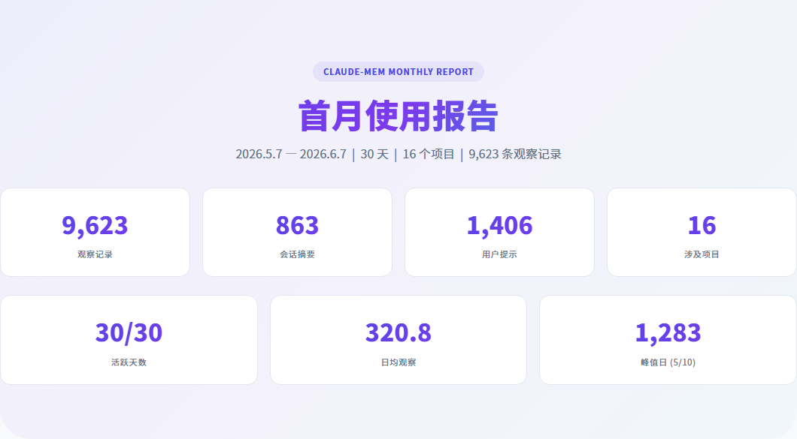
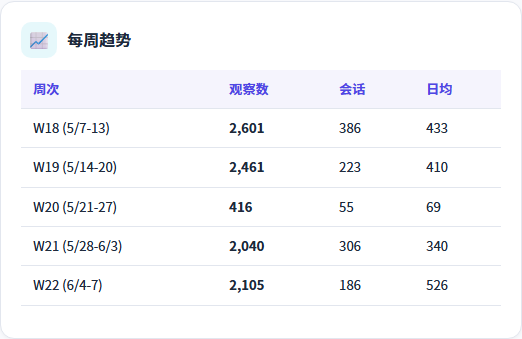
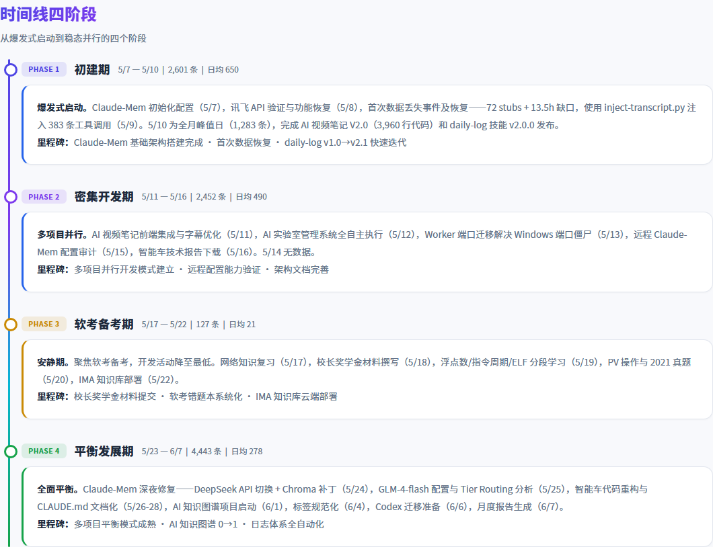
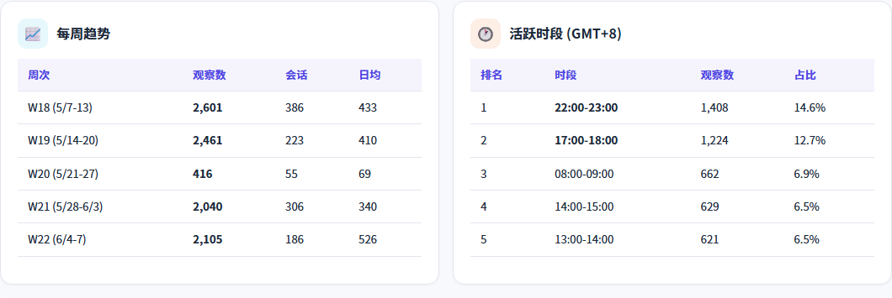
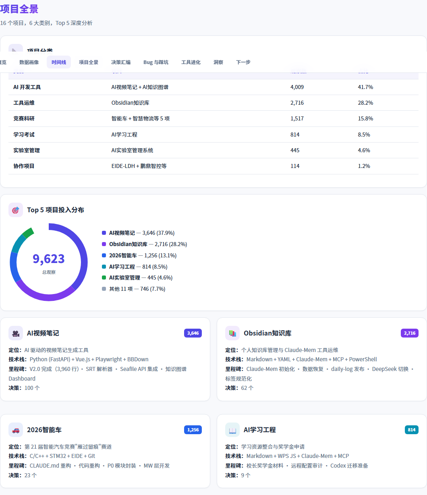
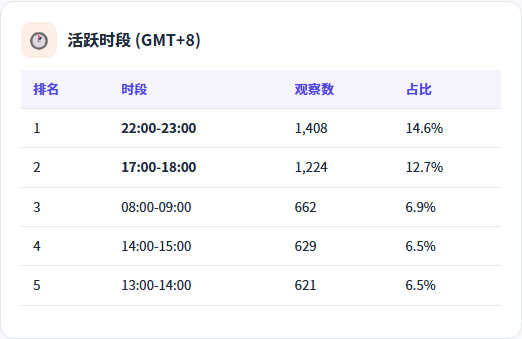
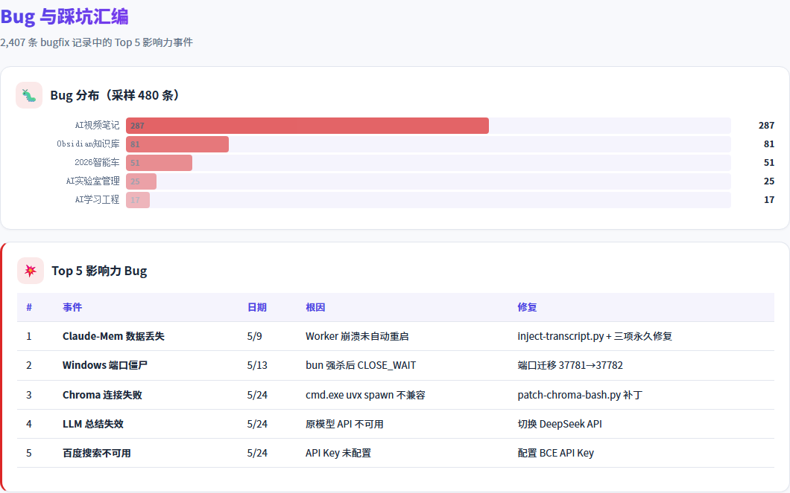
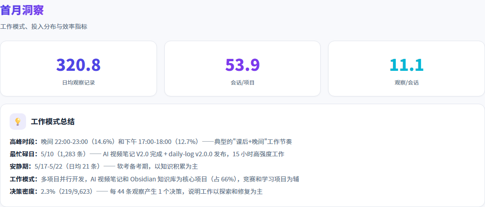

---
title: "我用AI记忆系统记录了30天开发，数据告诉了我什么？"
published: 2026-06-11
description: "9,623 条观察记录，863 个会话，16 个项目，30 天无间断。当 AI 开始帮你记住每一段代码、每一个决策、每一次 Bug，你对自己的开发习惯会有什么全新的认知？"
image: ""
tags: ["AI工具", "Claude-Mem", "开发效率", "数据分析", "个人成长"]
category: "技术"
draft: true
source_type: "original"
---

# 我用AI记忆系统记录了30天开发，数据告诉了我什么？

> 9,623 条观察记录，863 个会话，16 个项目，30 天无间断。当 AI 开始帮你记住每一段代码、每一个决策、每一次 Bug，你对自己的开发习惯会有什么全新的认知？

---

## 为什么我要做这件事

作为实验室负责人，我同时推进着智能车竞赛、AI 视频笔记工具、电子元件管理系统、实验室打卡分析等多个项目。问题不是"忙不忙"，而是"忙得对不对"——我经常感觉自己一天写了八小时代码，但回忆起来想不起到底推进了什么。

5 月初，我开始使用 Claude-Mem——一个 AI 持久记忆系统。它能跨会话记住你的每一次操作、每一个决策、每一次 Bug 修复。我没想过要"量化自己"，只是想让 AI 记住上下文，省得每次开新会话都要重复说明。

一个月后，9,623 条记录让我第一次**用数据看清了自己的开发习惯**。

---

## 数据全景：一个月到底发生了什么

先看硬数字：

| 维度 | 数值 |
|------|------|
| 观察记录总数 | 9,623 |
| 会话总数 | 863 |
| 用户提示（我发出的指令）| 1,406 |
| 活跃天数 | **30 / 30**（一天没落下）|
| 涉及项目数 | 16 |
| 日均观察记录 | 320.8 |
| 峰值日 | 5 月 10 日（1,283 条）|

9,623 条记录听起来很多，但真正有趣的不是总数——是**分布**。

### 每日活动量

> 下方柱状图中，紫色为初建期，淡紫为密集开发期，黄色为软考备考期，绿色为平衡发展期。

一眼就能看到四个截然不同的阶段。颜色的分段清晰地标记出节奏变化。

---

## 发现一：我的工作节奏是"脉冲式"的

这 30 天可以清晰地分成四个阶段：

**Phase 1 — 初建期（5/7-5/10）：日均 650 条**
疯狂搭建 Claude-Mem 基础设施，同时完成了 AI 视频笔记 V2.0 的 3,960 行代码。这是"赶工期"——什么都想一天搞完。

**Phase 2 — 密集开发期（5/11-5/16）：日均 490 条**
多项目并行模式启动。AI 视频笔记前端集成、AI 实验室管理系统全自主执行、远程机器配置……这段时间的决策密度极高。

**Phase 3 — 软考备考期（5/17-5/22）：日均 21 条**
断崖式下降。准备软考考试，开发活动几乎停止。但"几乎"——每天还是有少量技术记录（查 PCB 规则、做奖学金申请材料），说明我并没有完全脱离。

**Phase 4 — 平衡发展期（5/23-6/7）：日均 278 条**
回归常态。但和 Phase 1、2 不同的是，这个阶段更"稳"——没有单日过千的疯狂峰值，而是在 150-700 之间波动，说明我找到了**多项目并行的节奏**。

> **洞察**：我的开发节奏不是"匀速前进"，而是"脉冲式爆发+低谷恢复"。Phase 1 的高产出是不可持续的，Phase 4 才是常态。**真正的效率不在峰值，在基线。**

---

## 发现二：晚上 10 点是我的"黄金时间"

两个高峰：**晚上 10 点**和**下午 5 点**。

这不是"喜欢熬夜"那么简单。结合实际日志来看——晚上 10 点到 12 点通常是我**独立深度开发**的时间段（没人打扰，思路连贯），而下午 5 点左右往往是**问题排查和调试**的时段（白天上课结束后第一波集中时间）。

凌晨时段几乎为零，说明我没有在"硬熬"。这是好事。

> **行动建议**：把最需要深度思考的任务（架构设计、复杂 Bug）安排在 22:00-23:00；把代码审查、文档整理、配置调整放在白天碎片时间。

---

## 发现三：37.9% 的精力花在一个项目上

项目投入分布出乎意料地**不均匀**：

**AI 视频笔记**占了近四成。这个比例让我反思：它真的是当下最优先的项目吗？还是因为它"最容易进入心流状态"（写 Python 前端后端，反馈即时）而被过度投入？

**Obsidian 知识库**排第二，但其中大量记录来自 Claude-Mem 自身的运维和 daily-log 技能的开发——这是"元工作"（为工作而做的工作），需要警惕它是否在吞噬真正产出的时间。

**2026 智能车**只占 13.1%，但它是我作为实验室负责人最重要的竞赛项目。这个比例偏低，可能需要在未来主动增加投入。

> **洞察**：我们以为自己在"合理分配时间"，但数据不会说谎。花在"最容易做的事"上的时间，往往比"最重要的事"多得多。

---

## 发现四：25% 的时间在修 Bug

观察类型分布揭示了一个残酷的现实：

**四分之一的时间在修 Bug。** 这不是因为我代码写得差（好吧，可能有一点），而是因为我在同时推进 16 个项目，上下文切换的成本极高——每次切到一个新项目，都要花时间重新理解之前的状态，然后发现之前留下的坑。

Bug 最多的三个项目：AI 视频笔记（287 个）、Obsidian 知识库（81 个）、智能车（51 个）。

但换个角度看——38.7% 的"发现"记录意味着我花了大量时间在**探索和学习**上。这不是浪费，是投资。只是需要更好地平衡"探索"和"产出"的比例。

---

## 发现五：五个 Bug 教会我的事

这一个月最有价值的不是功能开发，而是踩过的坑。最有代表性的五个：

### 1. 数据丢失事件（5/9）
**72 条记录丢失，13.5 小时数据空白。** Worker 进程崩溃后没自动重启。教训：**不要信任任何"应该自动运行"的东西，定期检查健康状态。** 我写了一个 inject-transcript.py 恢复脚本，从此再没丢过数据。

### 2. Windows 端口僵尸（5/13）
强杀 bun 进程后，TCP 端口进入 CLOSE_WAIT 状态，**必须重启系统才能释放**。教训：**在 Windows 上，永远优雅停止进程，永远不要强杀。** 现在这条写进了我的运维规范。

### 3. Chroma 语义搜索连不上（5/4）
Windows cmd.exe 下 uvx spawn 不兼容，语义搜索功能直接废了。教训：**跨平台工具不要假设 Linux 行为，Windows 有自己的一套脾气。** 写了个补丁脚本，用 bash 替代 cmd.exe。

### 4. LLM 模型突然不可用（5/24）
原模型 API 失效，AI 压缩流程不生成摘要。教训：**永远有备用方案。** 现在我的配置里有三个模型轮换：MiMo 2.5 → glm-4-flash → DeepSeek。

### 5. 百度搜索 API 报错（5/24）
API Key 没配。这种低级错误说明：**新工具上线前，一定要跑一遍端到端验证。**

> **核心教训**：这五个 Bug 的共同点是——**它们都不是代码逻辑错误，而是环境和配置问题**。真正的技术债不在代码里，在运维和配置里。

---

## 发现六：AI 不只是帮我写代码，它在改变我的工作方式

这 30 天最有意思的不是"AI 帮我写了多少代码"，而是**它改变了我做决策的方式**。

月度报告显示，我做了 **219 个记录在案的决策**。这意味着平均每天做 7 个技术决策——选择什么框架、用什么架构、先做什么后做什么、遇到问题怎么取舍。

以前这些决策是"凭感觉"的。现在每做一次决策，Claude-Mem 都会记录当时的上下文、我考虑了什么、最终选了什么。回过头看，有些决策确实有问题：

- 5/10 选择自己写 daily-log v2.0.0，花了整整一天。事后看，如果更早用现有的模板框架，可能半天就够了。
- 5/12 决定用"独立 AI 分析表"而不是"直接字段更新"来做实验室管理系统。这个决策是对的——数据追溯能力大幅提升了。

**当你知道每个决策都会被记录，你会更认真地思考。** 这是 AI 记忆系统带来的最意外的副作用。

---

## 一个月后，我总结出的三条原则

### 原则一：基线比峰值重要
一天写 1,200 行代码不难，连续 30 天每天稳定输出 200 行才难。不要追求"爆肝日"，要建立可持续的工作节奏。

### 原则二：元工作要有上限
为工具花的时间不能超过为产品花的时间。如果你发现自己 80% 的时间在配置工具、调试工具、优化工具——停下来，用最朴素的方式先交活。

### 原则三：让数据说话，不要让感觉说话
"我觉得今天效率很高"和"今天观察记录 155 条，其中 bugfix 占 60%，新功能为零"——后者才更接近真相。

---

## 完整月度报告

下方嵌入了交互式月度报告，包含完整的数据可视化和导航：

<iframe src="/reports/2026-05月度报告.html" style="width:100%;height:80vh;border:1px solid var(--border,#e2e6ee);border-radius:12px" loading="lazy" title="Claude-Mem 首月使用报告"></iframe>

---

## 最后

用 AI 记忆系统记录 30 天的开发过程，最大的收获不是那些技术细节，而是获得了**一面不会说谎的镜子**。

它告诉你：你以为自己在多线程推进，其实在反复上下文切换；你以为自己在深度工作，其实在修昨天留下的坑；你以为自己在"差不多忙"，但项目 A 吃掉了项目 B 和 C 的时间。

数据不会让你变成更好的程序员。但数据会让你**看清**自己——然后，改变就是你自己的事了。

---

*工具：Claude-Mem + Claude Code*
*数据时间：2026-05-07 至 2026-06-07*
*数据来源：9,623 条观察记录，863 个会话摘要，1,406 条用户提示*
